# 🧠 AI-Powered Multimodal Adaptive Learning System
## 🏛️ Comprehensive End-to-End System Architecture & Feature Specification

---

## 📌 Executive Summary

The **AI-Powered Multimodal Adaptive Learning Platform** is an enterprise-grade, pedagogically aligned educational intelligence ecosystem designed for early childhood and primary school education (Pre-School through Grade 4).

The platform addresses core developmental and curricular milestones across **four primary learning pillars**:
1. **Pillar 1: Multimodal Adaptive Mathematics (Grades 2, 3, & 4)**
2. **Pillar 2: English Speech, Fluency & Articulatory Pronunciation Engine**
3. **Pillar 3: Pre-School & Grade 1 Foundations (Fine Motor, Creative & Cognitive Skills)**
4. **Pillar 4: Sinhala Language & Adaptive Handwriting Recognition (Grades 2, 3, & 4)**
5. **Centralized Pillar: Longitudinal Multi-Subject Progress Intelligence & Teacher Analytics**

---

## 🏗️ 1. High-Level System Architecture Diagram

```mermaid
graph TD
    subgraph ClientLayer ["1. Client Interaction Layer (React 18 + Vite + Tailwind CSS)"]
        UI_Math["🧮 Math Adaptive Module<br/>(Camera Emotion, Time, Input)"]
        UI_English["🗣️ English Speech Module<br/>(Mic Audio, WebCam Lips)"]
        UI_PreSchool["🎨 Pre-School & Motor Module<br/>(Canvas Tracing, Video, Coloring)"]
        UI_Sinhala["🦁 Sinhala Handwriting Module<br/>(Stylus/Mouse Canvas, Tracing)"]
        UI_Dashboard["📊 Student & Teacher Dashboards<br/>(Longitudinal Analytics & Mastery)"]
        Client_AI["👁️ Client-Side Vision AI<br/>(face-api.js TinyFaceDetector + Emotion Net)"]
    end

    subgraph GatewayLayer ["2. API Gateway & Application Server (Node.js + Express.js)"]
        Auth_Route["/api/auth (JWT & Role Auth)"]
        Math_Route["/api/math (Paper & Next-Q Generator)"]
        English_Route["/api/english (Speech & Pronunciation)"]
        Preschool_Route["/api/preschool & /api/creative"]
        Sinhala_Route["/api/sinhala (Handwriting & Tracing)"]
        Analytics_Route["/api/analytics (Multi-Subject Progress)"]
        Gemini_Bridge["☁️ Gemini 2.5 Flash API Bridge<br/>(Multimodal Video Craft Evaluator)"]
    end

    subgraph AIEngineLayer ["3. AI & Deep Learning Microservices (Python 3.10+ + FastAPI + PyTorch)"]
        AI_Math["🧠 MultimodalFusionNet &<br/>5-Stage Longitudinal Paper Generator"]
        AI_English["🎙️ PronunciationNet, Faster-Whisper ASR,<br/>Librosa YIN DSP, 12-MTI Rule Engine,<br/>Visual Lip Analyzer (OpenCV Haar/YCrCb)"]
        AI_Sinhala["✍️ SinhalaCharacterCNN (3-Block 2D CNN),<br/>Bidirectional Chamfer Distance Engine,<br/>Deep Knowledge Tracing LSTM (DKT)"]
        AI_Vision["🖼️ OpenAI CLIP ViT-B/32 Transformer<br/>(Zero-Shot Story Comprehension Classifier)"]
        AI_Motor["🏃 Pose Estimation & Stability Engine"]
    end

    subgraph DataLayer ["4. Persistence & Storage Layer (MongoDB Atlas & Local JSON Cache)"]
        DB_Users["Students & Teachers Collections"]
        DB_Attempts["QuestionAttempt Collection (Every Item Trace)"]
        DB_Analytics["StudentAnalytics (Mastery Vectors & Trajectories)"]
        DB_Creative["CreativeActivityRecord Collection"]
    end

    %% Connections
    UI_Math --> Client_AI
    Client_AI --> Math_Route
    UI_Math --> Math_Route
    UI_English --> English_Route
    UI_PreSchool --> Preschool_Route
    UI_Sinhala --> Sinhala_Route
    UI_Dashboard --> Analytics_Route

    Math_Route --> AI_Math
    English_Route --> AI_English
    Preschool_Route --> AI_Vision
    Preschool_Route --> AI_Motor
    Preschool_Route --> Gemini_Bridge
    Sinhala_Route --> AI_Sinhala
    Analytics_Route --> DB_Analytics

    Math_Route --> DB_Attempts
    English_Route --> DB_Attempts
    Sinhala_Route --> DB_Attempts
    Preschool_Route --> DB_Creative
    Auth_Route --> DB_Users
    Analytics_Route --> DB_Attempts
```



---

## 🤖 2. Master Inventory of All AI / ML Models & Mathematical Engines

The architecture integrates **14 dedicated AI models, neural networks, and computer vision engines**:

| # | Model / Engine Name | Technology Stack | Location | Input Data | Output / Prediction | Functional Role |
|---|-------------------|-----------------|----------|------------|---------------------|-----------------|
| **1** | **`TinyFaceDetector`** | MobileNetV1 / TensorFlow.js | Frontend (Client Browser) | WebCam Video Frames (60fps) | Bounding box coordinates $[x, y, w, h]$ | Real-time face localization during quizzes |
| **2** | **`FaceExpressionModel`** | Depthwise Separable CNN / face-api.js | Frontend (Client Browser) | Cropped Face ROI Image | Probabilities for 7 basic expressions | Confusion, frustration, and attention indicator |
| **3** | **`MultimodalFusionNet`** | PyTorch Neural Network | Python AI (`core_math/model.py`) | 5D Vector: $[C_{last}, t_{resp}, A_{score}, F_{score}, D_{curr}]$ | 3-Class Logits: $[-1, 0, +1]$ | Real-time math difficulty adjustment |
| **4** | **`Faster-Whisper (tiny.en)`** | 4-Layer Transformer ASR | Python AI (`core_english`) | 16kHz Mono PCM Audio | Word-level timestamped transcription | Offline automatic speech recognition |
| **5** | **`PronunciationNet`** | 3-Block 2D Spectrogram CNN | Python AI (`core_english/audio_model.py`) | MFCC Spectrogram ($40 \times 80$) | 13-Class Accent / MTI Logits | Acoustic phonetic accent classification |
| **6** | **`Librosa YIN & DSP Engine`** | Signal Processing / Scipy | Python AI (`core_english/fluency_prosody.py`) | Raw Audio Signal ($y \in \mathbb{R}^N$) | $F_0$ Pitch Contour, WPM, Pauses, RMS | Prosody, intonation, speech rate & volume |
| **7** | **`Needleman-Wunsch DP Alignment`** | Dynamic Programming Algorithm | Python AI (`core_english/phoneme_engine.py`) | Target IPA vs. Heard IPA Sequences | PER, Insertions, Deletions, Substitutions | Phoneme-level error detection |
| **8** | **`VisualLipAnalyzer`** | OpenCV Haar + YCrCb Masking | Python AI (`core_english/lip_analysis.py`) | Sequence of mouth video frames | MOR, Bilabial Closure, Lip Rounding | Articulatory visual mouth shape verification |
| **9** | **`OpenAI CLIP ViT-B/32`** | Dual-Encoder Vision-Language Transformer | Python AI (`main.py`) | Canvas Drawing Image + Prompt Embeddings | Cosine similarity against 16 characters | Zero-shot story comprehension evaluation |
| **10** | **`Gemini 2.5 Flash`** | Google Multimodal LLM | Cloud API (`backend/routes/preschool.js`) | Chronological Craft Video Frames | Step-by-step correctness JSON | Video papercraft & origami verification |
| **11** | **`SinhalaCharacterCNN`** | 3-Block 2D CNN with BatchNorm | Python AI (`core_sinhala/sinhala_cnn_model.py`) | Grayscale $64 \times 64$ Binary Image | 28 Sinhala Character Classes | Real-time handwritten letter classification |
| **12** | **`Bidirectional Chamfer Distance`** | Euclidean Distance Transform (`scipy.ndimage`) | Python AI (`core_sinhala/template_matcher.py`) | Student Drawing + Browser Reference ($64 \times 64$) | Distance metric $D_{chamfer} \rightarrow [0, 100]$ | Geometric stroke similarity scoring |
| **13** | **`DeepKnowledgeTracingLSTM`** | 2-Layer LSTM + Embeddings | Python AI (`core_sinhala/student_dkt_lstm.py`) | History: $[(c_t, y_t, t_t, h_t)]_{t=1}^T$ | Vector of Concept Masteries $P(L_t) \in [0, 1]$ | Cognitive mastery modeling & exercise routing |
| **14** | **`Multi-Criteria Tracing Engine`** | Weighted Geometric Spatial Engine | Python AI (`core_sinhala/tracing`) | Point Sequence $[(x, y, t)]_{i=1}^M$ + Template | $T = 0.35P + 0.25S + 0.20C + 0.10L + 0.10B$ | Multi-criteria Sinhala tracing evaluation |

---

## 🔍 3. Deep-Dive Feature Explanation: Input-to-Output Lifecycles

---

### 🧮 Feature 1: Multimodal Adaptive Mathematics (Grades 2, 3, & 4)

#### A. Objectives & Curriculum Coverage
- Covers **4 Key Mathematical Domains** per grade with **5 Granular Skills per Domain** (20 Competencies per grade).
- **Domains**: 
  1. *Numbers & Place Value* (e.g., Expanded Notation, 4-Digit Numbers, Number Patterns)
  2. *Operations & Computations* (e.g., 4-Digit Addition, 3-Digit Subtraction with Regrouping, Missing Addends)
  3. *Measurement & Geometry* (e.g., Metric Conversion $\text{m}\leftrightarrow\text{cm}$, Perimeters, Angles, Symmetry)
  4. *Fractions, Time & Money* (e.g., Decimal Tenths, Elapsed Time, Currency Change, Bill Problem Solving)

#### B. End-to-End Input $\rightarrow$ Processing $\rightarrow$ Output Pipeline

```
[Student Face (WebCam) + Answer Selection + Timer]
                      │
                      ▼
[Client-Side face-api.js: TinyFaceDetector extracts facial bounding box]
                      │
                      ▼
[FaceExpressionModel computes: Angry, Sad, Neutral, Happy, Surprised]
                      │
                      ▼
[Frustration Score F_score = P(Angry) + P(Sad) + P(Fearful) + P(Disgusted)]
                      │
                      ▼
[POST /api/math/next-question or POST /api/ai/math/generate-paper]
                      │
                      ▼
[Adaptive Paper Generator: 5-Stage Longitudinal Engine]
  ├─ Stage 1: Hard Duplicate Exclusion Filter (Excludes all historic answered question IDs)
  ├─ Stage 2: Competency / Weakness Sorting (Ascending mastery order)
  ├─ Stage 3: Difficulty Tier Matching (Tiers 1 to 5 based on calibrated mastery)
  ├─ Stage 4: Candidate Selection (Exact skill → Closest tier → Fallback unseen)
  └─ Stage 5: Invariant Assertions (Assert len(selected) == 20 AND overlap == 0)
                      │
                      ▼
[MultimodalFusionNet & Diagnostic Mastery Formulation]
  Mastery = (Accuracy * 0.5) + ((1.0 - F_score) * 0.3) + ((1.0 - (Time / mu_time) / 2) * 0.2)
                      │
                      ▼
[Output: Next Question Object + Difficulty Shift Notification + Student Mastery Vector]
```

#### C. Invariant Protections
- **Zero Question Repetition**: Guaranteed across multi-paper longitudinal test sessions (Papers 1 through 5).
- **Misconception Detection**: Categorizes specific wrong-answer choices into structured misconceptions (e.g., *Subtracted smaller digit from larger digit ignoring borrowing*).

---

### 🗣️ Feature 2: English Speech, Fluency & Articulatory Pronunciation Engine

#### A. Objectives & Pedagogy
- Evaluates English speaking and pronunciation for primary school students with special focus on **12 Sri Lankan Mother Tongue Influence (MTI)** patterns.
- Enforces a **Strict 100% Primary Pass Standard**: Complete word accuracy, correct acoustic pronunciation, and zero detected MTI patterns.

#### B. The 12 Sri Lankan MTI Pattern Knowledgebase

| # | Pattern Key | Name (English & Sinhala) | Target IPA | Error IPA / Heard | Pedagogical Correction |
|---|-------------|--------------------------|------------|-------------------|------------------------|
| **1** | `S_CLUSTER_PROSTHESIS` | S-Cluster Prosthesis (I-school) | `/skuːl/` | `/ɪskuːl/` | Start directly with hissing `'sss'` without adding `'is-'`. |
| **2** | `V_W_MERGER` | V/W Merger (Wery / Vindow) | `/ˈveri/` | `/ˈweri/` | For `'W'`, round lips into `'O'`. For `'V'`, touch top teeth to lower lip. |
| **3** | `TH_SUBSTITUTION` | TH Substitution (Tree for Three) | `/θriː/` | `/triː/` | Place tongue tip between front teeth and gently blow air. |
| **4** | `F_P_SUBSTITUTION` | F/P Substitution (Pan for Fan) | `/fæn/` | `/pæn/` | Place upper teeth on lower lip (do not press both lips together). |
| **5** | `PARAGOGE` | Paragoge (Busa / Milka) | `/bʌs/` | `/bʌsə/` | End cleanly at the final consonant without adding extra `'-a'`. |
| **6** | `FINAL_CONSONANT_WEAKENING` | Final Consonant Deletion | `/bʌt/` | `/bʌ/` | Pronounce the ending `'t'`, `'d'`, `'k'` sound audibly. |
| **7** | `CLUSTER_SIMPLIFICATION` | Cluster Simplification (Neks for Next) | `/nekst/` | `/neks/` | Clearly pronounce all consonants in the cluster (`s` and `t`). |
| **8** | `VOWEL_LENGTH_CONFUSION` | Short/Long Vowel Confusion | `/keɪk/` | `/kek/` | Elongate the diphthong (`kay-eek` instead of short `kek`). |
| **9** | `INITIAL_H_DELETION` | Initial H Dropping (Ouse for House) | `/haʊs/` | `/aʊs/` | Exhale gently (`'hhh'`) before starting the initial vowel. |
| **10** | `Z_S_CONFUSION` | Z/S Voicing Confusion (Busi for Busy) | `/zuː/` | `/suː/` | Vibrate vocal cords like a buzzing bee (`'zzz'`). |
| **11** | `BACK_VOWEL_CONFUSION` | Back Vowel Confusion (Hol for Hall) | `/hɔːl/` | `/hɒl/` | Drop jaw and open mouth taller for the `/ɔː/` sound. |
| **12** | `STRESS_RHYTHM_DEVIATION` | Syllable-Timed Robot Rhythm | `/kəmˈpjuːtər/` | Flat Stress | Emphasize stressed syllables; speak unstressed quickly. |

#### C. End-to-End Input $\rightarrow$ Processing $\rightarrow$ Output Pipeline

```
[Student Audio (Mic 16kHz Base64) + Video Frames (WebCam Base64) + Target Text]
                                   │
                                   ▼
[Audio Decoding & DSP Noise Suppression: 4th Order Butterworth Bandpass (85Hz-7.5kHz)]
                                   │
                                   ▼
[Dynamic Noise Gate: RMS percentile-15 thresholding removes stationary background hum]
                                   │
                ┌──────────────────┴──────────────────┐
                ▼                                     ▼
[Speech-to-Text Recognition]             [Visual Lip Articulation Analyzer]
- Faster-Whisper / Google ASR            - OpenCV Haar Cascade isolates Mouth ROI
- Generates Spoken Transcript            - Otsu threshold on YCrCb Cr channel (Lip contour)
- Word Error Rate (WER) calculation      - Inner oral cavity mask: measures Mouth Opening Ratio (MOR)
                                         - Bilabial Closure: Detects lip pressed shut (/p/ vs /f/)
                                         - Lip Rounding: Circular aspect ratio for /w/ vs /v/
                │                                     │
                └──────────────────┬──────────────────┘
                                   │
                                   ▼
[Acoustic Fluency & Prosody Engine (Librosa)]
  ├─ Speech Rate: WPM = (Word Count / Duration) * 60 (Optimal: 70 - 160 WPM)
  ├─ Pause Analysis: Significant (>=200ms), Long (>=500ms), Severe (>=1000ms)
  ├─ Intonation Contour: YIN algorithm extracts F0 pitch (Monotone if variance < 15Hz)
  ├─ Sentence Slope: Rising (Question) vs. Falling (Statement)
  ├─ Acoustic Volume: RMS power vs. noise floor
  └─ Syntactic Analysis: Repetition detection + Sinhala code-mixing word filter
                                   │
                                   ▼
[Needleman-Wunsch Dynamic Programming Phoneme Alignment]
  Matches Target IPA Phones vs. Spoken Phones -> Calculates Phoneme Accuracy %
                                   │
                                   ▼
[Output: 6-Dimensional Diagnostic Card + Bilingual Sinhala/English Pedagogical Tips]
```

---

### 🎨 Feature 3: Pre-School & Grade 1 Foundations (Fine Motor, Creative & Cognitive Skills)

#### A. Interactive Sub-Modules
1. **Digital & Physical Line Tracing**:
   - Assesses fine motor pencil control and boundary compliance on canonical worksheets (fruits, animals, zigzag, wave lines).
   - **Algorithm**: Euclidean distance search with ultra-strict pixel tolerance ($\le 3\text{px}$). Off-target pixels rendered in bright Red; on-target pixels in Green.
   - **Formulas**:
     $$\text{Completion} = \min\left(100, \frac{\text{HitPixels}}{\text{TotalExpected} \times \text{Multiplier}} \times 100\right)$$
     $$\text{Accuracy} = \min\left(100, \frac{\text{DrawnOnTarget}}{\text{DrawnOnTarget} + \text{DrawnOffTarget}} \times 115\%\right)$$
     $$\text{Overall Score} = 0.4 \times \text{Accuracy} + 0.6 \times \text{Completion}$$

2. **Digital & Physical Coloring Assessment**:
   - Compares user coloring against reference images using flood-fill contour masks.
   - Computes:
     - **Boundary Adherence**: Percentage of ink kept inside boundary outlines.
     - **Coverage Ratio**: Percentage of target interior filled.
     - **Color Matching Accuracy**: Cosine similarity in RGB space against target palette, with **human-like forgiving color matching** (e.g., Red accepts Pink, Orange accepts Yellow).

3. **Computer Vision Origami Folding & Paper Craft Tracking**:
   - Uses real-time camera computer vision to guide step-by-step paper folding.
   - **Algorithms**:
     - *Convex Hull* for paper outline.
     - *Douglas-Peucker Polygon Simplification* for corner detection.
     - Detects aspect ratios (Square vs. Rectangle vs. Triangle) to verify folding stages.

4. **Generative AI Video Craft Analysis (Gemini 2.5 Flash)**:
   - Evaluates multi-step physical crafts (Paper Boat, Airplane, Crown, Windmill).
   - Extracts 6 evenly spaced chronological frames from the user's uploaded video $\rightarrow$ sends to Gemini 2.5 Flash $\rightarrow$ validates sequential fold completion.

5. **Semantic Story Drawing Comprehension (OpenAI CLIP Transformer)**:
   - Evaluates child's original drawing against story themes (e.g., *The Ant and the Dove*, *The Lion and the Mouse*).
   - **Model**: `openai/clip-vit-base-patch32`.
   - **Discriminative Classifier**: Evaluates drawing against positive character prompts, **general negative scenery confusers** (landscapes, mountains without animals), and **vehicle/building negative confusers** to avoid false positives.

---

### 🦁 Feature 4: Sinhala Language & Adaptive Handwriting (Grades 2, 3, & 4)

#### A. Objectives & Curriculum Breakdown
- Structured into **5 Core Linguistic Categories**:
  - **C1: සමාන පද හා අර්ථ (Synonyms & Meanings)**
  - **C2: විරුද්ධ පද (Antonyms)**
  - **C3: ප්‍රස්තාව පිරුළු / ඉඟි වැකි (Proverbs & Idioms)**
  - **C4: කාලය හා ව්‍යාකරණ (Grammar, Tenses & Subject-Verb Agreement)**
  - **C5: කියවීම හා විරාම ලක්ෂණ (Reading Comprehension & Punctuation)**
- Integrates a **Dual Evaluation Rule**:
  $$\text{Item Correct} = \text{MultipleChoiceAnswerCorrect} \land (\text{HandwritingTracingScore} \ge 85\%)$$

#### B. Sinhala Handwriting Vision & Tracing Engine Architecture

```
[Stylus / Mouse Drawing on HTML5 Canvas (Base64)] + [Target Sinhala Letter]
                                  │
                                  ▼
[Canvas Preprocessing: Crop to Bounding Box + Normalize to 64x64 float32]
                                  │
         ┌────────────────────────┴────────────────────────┐
         ▼                                                 ▼
[SinhalaCharacterCNN (3-Block 2D CNN)]        [Bidirectional Chamfer Distance Engine]
- Block 1: 1 -> 32 channels (Contours)        - Hidden browser canvas renders ground-truth
- Block 2: 32 -> 64 (Hooks & Kombu)             letter using Iskoola Pota native font
- Block 3: 64 -> 128 (Composite Graphemes)    - Computes Euclidean Distance Transform (EDT)
- FC Layer: 256 -> 28 Class Logits            - d(Student -> Reference) = Mean dist to nearest ref ink
- Predicts character + Confidence %           - d(Reference -> Student) = Mean dist to nearest user ink
                                              - Chamfer = max(d_s->r, d_r->s)
                                              - Score = max(0, (1.0 - Chamfer / 12.0) * 100)
         │                                                 │
         └────────────────────────┬────────────────────────┘
                                  │
                                  ▼
[Multi-Criteria Tracing Composite Score Engine]
  T = 0.35 * P (Path Adherence) +
      0.25 * S (Shape Similarity) +
      0.20 * C (Completeness) +
      0.10 * L (Line Alignment) +
      0.10 * B (Boundary Accuracy)
  Passing Criterion: T >= 85.0% AND all sub-components >= 70.0%
                                  │
                                  ▼
[Deep Knowledge Tracing (DKT) LSTM Cognitive Model]
  Input: Sequence of interaction tuples (Concept_ID, Correctness, Time, Hints)
  Embedding: 32D Concept Embedding + 3D Observables -> 2-Layer LSTM (Hidden=64)
  Output: Calibrated Mastery Vector P(L_t) across all curriculum concepts
  Next-Step Policy:
    ├─ If Mastery >= 78% & Accuracy >= 90%: Fast-Track Promotion to Next Level
    ├─ If Mastery >= 55%: Sequential Step
    └─ If Mastery < 55%: Targeted Remediation on Weakest Letter/Pillama
```

---

### 📊 Feature 5: Multi-Subject Longitudinal Analytics & Teacher Dashboard

#### A. Longitudinal Cognitive Fingerprint
- Aggregates interaction history across all 4 subjects in real time.
- Maintains dynamic mastery vectors stored in MongoDB Atlas (`StudentAnalytics` and `QuestionAttempt` collections).
- Automatically triggers **Targeted Remedial Recommendations** linking students directly to the module addressing their lowest-scoring skill.

#### B. Teacher Dashboard Capabilities
- **Class Enrollment & Overview**: Multi-grade cohort tracking (Preschool through Grade 4).
- **Subject-Specific Competency Breakdown**: Average mastery for every sub-category (M1-M4, C1-C5, E1-E4, P1-P4).
- **Individual Student Progress Trajectories**: Weekly performance trends, exercise completion rates, and historical attempt timelines.
- **Export & Reporting**: Automated reporting for parent-teacher reviews.

---

## 🗂️ 4. File-to-Feature Architectural Mapping

| File Path | Primary Component / Role | Core AI / Technology |
|---|---|---|
| [`backend/server.js`](file:///d:/Kids/backend/server.js) | Express API Gateway & Route Orchestrator | Node.js, Express, Mongoose, CORS |
| [`backend/routes/english.js`](file:///d:/Kids/backend/routes/english.js) | English Speech Endpoint & 3-Stage Fallback | REST Bridge, Fallback Heuristics |
| [`backend/routes/math.js`](file:///d:/Kids/backend/routes/math.js) | Adaptive Math Paper & Attempt Logger | Longitudinal Question Bank Bridge |
| [`backend/routes/preschool.js`](file:///d:/Kids/backend/routes/preschool.js) | Pre-School & Creative API + Gemini Bridge | Google Generative AI SDK, Gemini 2.5 |
| [`backend/routes/sinhala.js`](file:///d:/Kids/backend/routes/sinhala.js) | Sinhala Handwriting Evaluation Forwarder | FastAPI Proxy Bridge |
| [`backend/routes/analytics.js`](file:///d:/Kids/backend/routes/analytics.js) | Longitudinal Multi-Subject Intelligence | MongoDB Mongoose Aggregations |
| [`python-ai/main.py`](file:///d:/Kids/python-ai/main.py) | Central AI Microservice API | FastAPI, PyTorch, Uvicorn |
| [`python-ai/core_math/model.py`](file:///d:/Kids/python-ai/core_math/model.py) | Multimodal Math Neural Network | PyTorch `MultimodalFusionNet` |
| [`python-ai/core_math/adaptive_paper_generator.py`](file:///d:/Kids/python-ai/core_math/adaptive_paper_generator.py) | 5-Stage Adaptive Paper Generator | Invariant Assertions, Hard Non-Repetition |
| [`python-ai/core_english/fluency_prosody.py`](file:///d:/Kids/python-ai/core_english/fluency_prosody.py) | Prosody, Intonation & Fluency Engine | Librosa, YIN, RMS, FFT |
| [`python-ai/core_english/mti_rules.py`](file:///d:/Kids/python-ai/core_english/mti_rules.py) | 12 Sri Lankan MTI Rule Detectors | Dual Acoustic & Textual MTI Engine |
| [`python-ai/core_english/lip_analysis.py`](file:///d:/Kids/python-ai/core_english/lip_analysis.py) | Visual Mouth & Lip Articulation Kinematics | OpenCV Haar Cascades, YCrCb, Otsu |
| [`python-ai/core_english/phoneme_engine.py`](file:///d:/Kids/python-ai/core_english/phoneme_engine.py) | G2P Lexicon & Phoneme Alignment | Needleman-Wunsch Dynamic Programming |
| [`python-ai/core_sinhala/sinhala_cnn_model.py`](file:///d:/Kids/python-ai/core_sinhala/sinhala_cnn_model.py) | Sinhala Character CNN Classifier | PyTorch 3-Block 2D CNN |
| [`python-ai/core_sinhala/template_matcher.py`](file:///d:/Kids/python-ai/core_sinhala/template_matcher.py) | Bidirectional Chamfer Distance Engine | `scipy.ndimage.distance_transform_edt` |
| [`python-ai/core_sinhala/student_dkt_lstm.py`](file:///d:/Kids/python-ai/core_sinhala/student_dkt_lstm.py) | Deep Knowledge Tracing LSTM Engine | PyTorch 2-Layer LSTM with Embeddings |
| [`python-ai/core_sinhala/tracing/scoring.py`](file:///d:/Kids/python-ai/core_sinhala/tracing/scoring.py) | Multi-Criteria Tracing Weighted Scorer | 5-Component Weighted Formula |
| [`frontend/src/components/english/EnglishModule.jsx`](file:///d:/Kids/frontend/src/components/english/EnglishModule.jsx) | English Speech & Articulation UI | Web Audio API, Speech Recognition |
| [`frontend/src/components/sinhala/SinhalaModule.jsx`](file:///d:/Kids/frontend/src/components/sinhala/SinhalaModule.jsx) | Sinhala Tracing & Handwriting Canvas | HTML5 Canvas, OpenType Rendering |
| [`frontend/src/components/math/MathGrade2AdaptiveModule.jsx`](file:///d:/Kids/frontend/src/components/math/MathGrade2AdaptiveModule.jsx) | Grade 2 Adaptive Math with Emotion AI | `face-api.js`, TinyFaceDetector |
| [`frontend/src/components/preschool/ColoringModule.jsx`](file:///d:/Kids/frontend/src/components/preschool/ColoringModule.jsx) | Digital & Physical Coloring Evaluator | Canvas Flood-Fill, Cosine RGB Match |
| [`frontend/src/components/preschool/OrigamiModule.jsx`](file:///d:/Kids/frontend/src/components/preschool/OrigamiModule.jsx) | Real-Time Video Origami Tracking | Convex Hull, Douglas-Peucker Polygon |
| [`frontend/src/components/preschool/StoryDrawingModule.jsx`](file:///d:/Kids/frontend/src/components/preschool/StoryDrawingModule.jsx) | Semantic Story Drawing Comprehension | CLIP Zero-Shot Vision Classifier |
| [`frontend/src/components/preschool/MotorModule.jsx`](file:///d:/Kids/frontend/src/components/preschool/MotorModule.jsx) | Motor Tracing & Pencil Control | Strict Spatial Tolerance Masking |
| [`frontend/src/pages/TeacherDashboard.jsx`](file:///d:/Kids/frontend/src/pages/TeacherDashboard.jsx) | Multi-Subject Class Progress Intelligence | React, Tailwind, Lucide Analytics |

---

## 🔒 5. Fault Tolerance & Fallback Strategy

The platform is designed with a **three-tier resilience architecture**:
1. **Tier 1: Cloud & Python Microservices Live**: Full deep learning inference (PyTorch CNNs, CLIP Transformer, Faster-Whisper, Gemini 2.5, DKT LSTM).
2. **Tier 2: Node.js / Express Gateway Fallback**: If the Python microservice is offline, Express automatically executes built-in 3-stage heuristics, Levenshtein matching, and mock generators so that student quizzes never crash.
3. **Tier 3: Browser / Client-Side Offline Autonomy**: If the backend database is unreachable, the React client automatically persists student sessions and paper histories in `localStorage` and falls back to local JSON question banks with real-time browser Canvas image processing.

---
*Generated for the AI Adaptive Learning System Engineering & Academic Documentation.*
